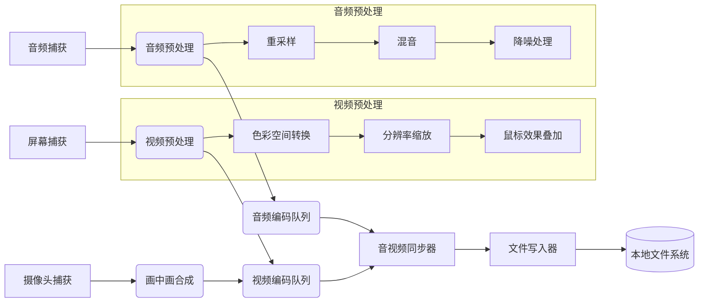
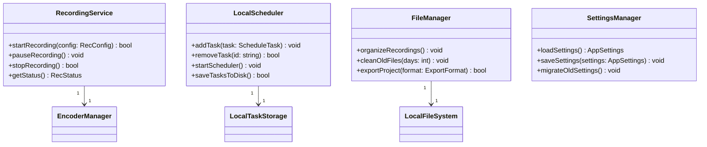
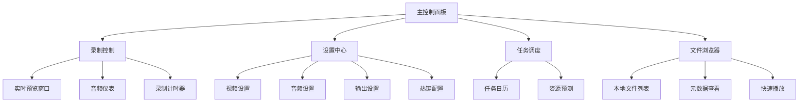

# AIcp# 屏幕录制程序架构设计文档

## 整体架构概述

本项目采用分层架构设计，共分为四层：
1. 用户界面层 (UI Layer)
2. 应用服务层 (Application Service Layer)
3. 核心引擎层 (Core Engine Layer)
4. 平台抽象层 (Platform Abstraction Layer)

## 目录结构

```
AIcp#/
├── src/                   # 源代码目录
│   ├── platform/          # 平台抽象层实现
│   ├── core/              # 核心引擎层实现
│   ├── service/           # 应用服务层实现
│   ├── ui/                # 用户界面层实现
│   └── main.cpp           # 主程序入口
├── include/               # 公共头文件
├── assets/                # 资源文件（图标、图片等）
├── docs/                  # 项目文档
├── cmake/                 # CMake模块
├── tests/                 # 测试代码
├── CMakeLists.txt         # 构建配置文件
├── README.md              # 项目说明
└── LICENSE                # 许可证文件
```

## 各层详细设计

### 1. 平台抽象层 (Platform Abstraction Layer)

平台抽象层负责屏蔽不同操作系统之间的差异，提供统一的接口供上层调用。

#### 核心接口定义

```cpp
// ILocalCapture.h
class ILocalCapture {
public:
    virtual ~ILocalCapture() = default;
    virtual bool init() = 0;
    virtual FrameData captureFrame() = 0;
    virtual void release() = 0;
};

// ILocalEncoder.h
class ILocalEncoder {
public:
    virtual ~ILocalEncoder() = default;
    virtual bool setup(const EncoderConfig& config) = 0;
    virtual EncodedData encode(const FrameData& frame) = 0;
    virtual bool finalize(const std::string& outputPath) = 0;
};
```

#### 平台特定实现

| 组件           | Windows实现                 | macOS实现                  | Linux实现                |
|----------------|----------------------------|---------------------------|--------------------------|
| **屏幕捕获**   | DXGI Desktop Duplication   | CoreGraphics + IOSurface  | X11/XShm 或 PipeWire     |
| **音频捕获**   | WASAPI Loopback            | AudioQueue                | PulseAudio               |
| **摄像头**     | Media Foundation           | AVFoundation              | V4L2                     |
| **硬件编码**   | NVENC/DXVA                 | VideoToolbox              | VAAPI                    |
| **文件系统**   | Win32 API                  | NSFileManager             | POSIX File API           |

### 2. 核心引擎层 (Core Engine Layer)

核心引擎层负责音视频数据的处理、编码和文件写入。

#### 数据处理流水线



### 3. 应用服务层 (Application Service Layer)

应用服务层提供高层次的业务逻辑和服务管理。

#### 类图设计



### 4. 用户界面层 (UI Layer)

用户界面层基于Qt 6开发，提供直观易用的操作界面。

#### 界面模块设计



## 技术选型

| 模块           | 技术选型                                | 说明                         |
|----------------|----------------------------------------|------------------------------|
| **核心框架**   | Qt 6.4 (GUI + 基础库)                 | 跨平台UI解决方案             |
| **多媒体处理** | FFmpeg 6.0 (LGPL)                     | 本地编码/解码/复用          |
| **硬件加速**   | 平台专用API (DXVA/NVENC/VideoToolbox) | 最大化本地性能              |
| **音频处理**   | SpeexDSP + RNNoise                     | 本地降噪处理                |
| **数据库**     | SQLite3                                | 本地任务存储                |
| **本地存储**   | 平台原生文件API                        | 直接文件操作                |

## 性能优化策略

1. **内存映射文件写入**
2. **本地缓存优化**
3. **硬件资源感知调度**

## 安全与隐私增强

1. **本地数据保护**
2. **权限控制**
3. **可选文件加密**

## 安装包精简方案

| 平台      | 技术方案                      | 体积目标 | 特点                     |
|-----------|-----------------------------|----------|--------------------------|
| Windows   | MSI (WiX) + 动态链接        | < 12MB   | 仅包含必要DLL            |
| macOS     | APP Bundle + 瘦身           | < 18MB   | 移除无用架构切片         |
| Linux     | AppImage + 依赖检查         | < 15MB   | 仅包含核心依赖           |

## 扩展性设计

1. **本地插件系统**
2. **命令行接口**