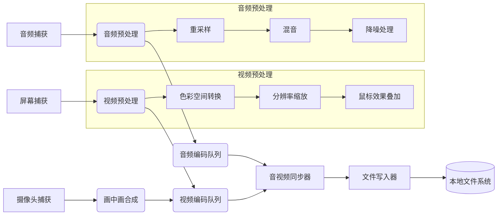

# 核心引擎层设计文档

## 概述

核心引擎层是屏幕录制程序的核心处理单元，负责音视频数据的捕获、处理、编码和文件写入。这一层建立在平台抽象层之上，为应用服务层提供高质量的录制功能。

## 架构设计

### 数据处理流水线



## 核心组件设计

### 1. 视频预处理器 (VideoPreprocessor)

```cpp
class VideoPreprocessor {
public:
    /**
     * 色彩空间转换
     * @param frame 输入帧
     * @param targetFormat 目标格式
     * @return 转换后的帧
     */
    FrameData convertColorSpace(const FrameData& frame, PixelFormat targetFormat);
    
    /**
     * 分辨率缩放
     * @param frame 输入帧
     * @param width 目标宽度
     * @param height 目标高度
     * @return 缩放后的帧
     */
    FrameData scaleFrame(const FrameData& frame, int width, int height);
    
    /**
     * 叠加鼠标效果
     * @param frame 输入帧
     * @param mousePos 鼠标位置
     * @return 叠加后的帧
     */
    FrameData overlayMouseEffect(const FrameData& frame, Point mousePos);
};
```

### 2. 音频预处理器 (AudioPreprocessor)

```cpp
class AudioPreprocessor {
public:
    /**
     * 重采样
     * @param audio 输入音频数据
     * @param targetSampleRate 目标采样率
     * @return 重采样后的音频数据
     */
    AudioData resample(const AudioData& audio, int targetSampleRate);
    
    /**
     * 混音处理
     * @param audios 多路音频输入
     * @return 混音后的音频数据
     */
    AudioData mix(const std::vector<AudioData>& audios);
    
    /**
     * 降噪处理
     * @param audio 输入音频数据
     * @return 降噪后的音频数据
     */
    AudioData denoise(const AudioData& audio);
};
```

### 3. 本地文件写入器 (LocalFileWriter)

```cpp
class LocalFileWriter {
public:
    /**
     * 打开文件
     * @param path 文件路径
     * @param format 文件格式
     * @return true 成功, false 失败
     */
    bool open(const std::string& path, FileFormat format);
    
    /**
     * 写入媒体包
     * @param packet 媒体包
     * @return true 成功, false 失败
     */
    bool writePacket(const MediaPacket& packet);
    
    /**
     * 完成写入并关闭文件
     * @return true 成功, false 失败
     */
    bool finalize();
    
private:
    FileHandle fileHandle;
    std::mutex writeMutex;
    uint64_t bytesWritten = 0;
    
    /**
     * 判断是否需要分割文件
     * @return true 需要分割, false 不需要
     */
    bool shouldSplitFile() const;
};
```

### 4. 资源感知编码器 (ResourceAwareEncoder)

```cpp
class ResourceAwareEncoder {
public:
    /**
     * 根据系统资源调整编码参数
     */
    void adjustEncodingBasedOnResources();
    
private:
    /**
     * 获取系统资源状态
     * @return SystemResources 系统资源信息
     */
    SystemResources getSystemResources();
};
```

### 5. 音视频同步器 (AVSyncer)

```cpp
class AVSyncer {
public:
    /**
     * 同步音视频数据
     * @param videoFrames 视频帧队列
     * @param audioFrames 音频帧队列
     * @return 同步后的媒体包列表
     */
    std::vector<MediaPacket> sync(
        const std::queue<FrameData>& videoFrames,
        const std::queue<AudioData>& audioFrames);
};
```

## 性能优化策略

### 1. 内存映射文件写入

```cpp
class MappedFileWriter {
public:
    /**
     * 打开内存映射文件
     * @param path 文件路径
     * @param maxSize 最大大小
     * @return true 成功, false 失败
     */
    bool open(const std::string& path, size_t maxSize);
    
private:
    FileHandle fileHandle;
    void* buffer;
};
```

### 2. 本地缓存优化

- 视频帧环形缓冲区（零拷贝）
- 音频采样池
- 预分配磁盘空间

### 3. 硬件资源感知调度

```cpp
void adjustWorkersBasedOnResources() {
    SystemStatus status = getSystemStatus();
    
    if (status.cpuUsage > 80.0) {
        videoProcessing.setThreadCount(1);
        audioProcessing.disableExtraEffects();
    }
    
    if (status.memoryUsage > 90.0) {
        frameCache.reduceSize(50);
        encoder.useFasterPreset();
    }
}
```

## 错误处理与恢复

### 1. 异常安全

所有核心组件都应具备异常安全特性，确保在出现异常时能够正确释放资源。

### 2. 错误恢复

```cpp
class RecoveryManager {
public:
    /**
     * 恢复上次未完成的录制
     * @param recoveryInfo 恢复信息
     * @return true 成功, false 失败
     */
    bool recover(const RecoveryInfo& recoveryInfo);
};
```

## 测试策略

### 单元测试

每个核心组件都需要有完整的单元测试覆盖：
1. 功能正确性测试
2. 边界条件测试
3. 性能基准测试
4. 异常处理测试

### 集成测试

1. 数据流完整性测试
2. 跨平台兼容性测试
3. 资源使用效率测试
4. 压力测试

## 依赖关系

核心引擎层主要依赖：
- 平台抽象层接口
- FFmpeg库(LGPL)
- SpeexDSP/RNNoise音频处理库
- C++标准库

## 配置管理

核心引擎应支持灵活的配置管理：

```cpp
struct EngineConfig {
    // 视频设置
    int maxWidth;
    int maxHeight;
    int maxFPS;
    int maxBitrate;
    
    // 音频设置
    int sampleRate;
    int channels;
    
    // 性能设置
    bool enableHardwareAcceleration;
    int maxThreads;
    
    // 存储设置
    std::string defaultOutputPath;
    bool enableFileSplitting;
    size_t maxFileSize;
};
```

## 扩展性设计

核心引擎设计时考虑了良好的扩展性：
1. 插件化效果处理
2. 可配置的处理流程
3. 模块化的组件设计
4. 清晰的接口定义