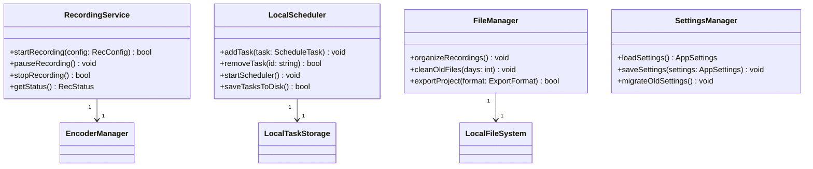

# 应用服务层设计文档

## 概述

应用服务层位于核心引擎层之上，为用户界面层提供高层次的业务逻辑和服务管理。这一层负责协调各个核心组件，管理应用程序的状态，并处理用户请求。

## 架构设计

### 类图设计



## 核心服务设计

### 1. 录制服务 (RecordingService)

```cpp
class RecordingService {
public:
    /**
     * 开始录制
     * @param config 录制配置
     * @return true 成功, false 失败
     */
    bool startRecording(const RecConfig& config);
    
    /**
     * 暂停录制
     */
    void pauseRecording();
    
    /**
     * 停止录制
     * @return true 成功, false 失败
     */
    bool stopRecording();
    
    /**
     * 获取录制状态
     * @return RecStatus 当前状态
     */
    RecStatus getStatus();
    
private:
    std::unique_ptr<VideoCapture> videoCapture;
    std::unique_ptr<AudioCapture> audioCapture;
    std::unique_ptr<Encoder> encoder;
    RecStatus status;
};
```

### 2. 本地任务调度器 (LocalScheduler)

```cpp
class LocalScheduler {
public:
    /**
     * 添加定时任务
     * @param task 任务对象
     */
    void addTask(const ScheduleTask& task);
    
    /**
     * 移除任务
     * @param id 任务ID
     * @return true 成功, false 失败
     */
    bool removeTask(const std::string& id);
    
    /**
     * 启动调度器
     */
    void startScheduler();
    
    /**
     * 保存任务到磁盘
     * @return true 成功, false 失败
     */
    bool saveTasksToDisk();
    
private:
    /**
     * 检查是否可以启动任务
     * @param task 任务对象
     * @return true 可以启动, false 不能启动
     */
    bool canStartTask(const ScheduleTask& task);
    
    std::map<std::string, ScheduleTask> tasks;
    std::unique_ptr<SQLiteDB> db;
};
```

### 3. 文件管理器 (FileManager)

```cpp
class FileManager {
public:
    /**
     * 整理录制文件
     */
    void organizeRecordings();
    
    /**
     * 清理旧文件
     * @param days 保留天数
     */
    void cleanOldFiles(int days);
    
    /**
     * 导出项目
     * @param format 导出格式
     * @return true 成功, false 失败
     */
    bool exportProject(ExportFormat format);
    
private:
    std::string basePath;
};
```

### 4. 设置管理器 (SettingsManager)

```cpp
class SettingsManager {
public:
    /**
     * 加载设置
     * @return AppSettings 应用设置
     */
    AppSettings loadSettings();
    
    /**
     * 保存设置
     * @param settings 应用设置
     */
    void saveSettings(const AppSettings& settings);
    
    /**
     * 迁移旧设置
     */
    void migrateOldSettings();
    
private:
    std::string configPath;
};
```

## 数据结构定义

### 1. 录制配置 (RecConfig)

```cpp
struct RecConfig {
    // 视频设置
    Rect captureArea;        // 捕获区域
    int width;               // 宽度
    int height;              // 高度
    int fps;                 // 帧率
    std::string codec;       // 编码器
    
    // 音频设置
    bool captureAudio;       // 是否捕获音频
    bool captureMic;         // 是否捕获麦克风
    
    // 输出设置
    std::string outputPath;  // 输出路径
    std::string fileName;    // 文件名
    FileFormat format;       // 文件格式
};
```

### 2. 定时任务 (ScheduleTask)

```cpp
struct ScheduleTask {
    std::string id;          // 任务ID
    std::string name;        // 任务名称
    time_t startTime;        // 开始时间
    time_t endTime;          // 结束时间
    RecConfig config;        // 录制配置
    bool repeat;             // 是否重复
    int repeatInterval;      // 重复间隔(分钟)
};
```

### 3. 应用设置 (AppSettings)

```cpp
struct AppSettings {
    // UI设置
    Theme theme;             // 主题
    Language language;       // 语言
    
    // 录制默认设置
    RecConfig defaultConfig; // 默认录制配置
    
    // 存储设置
    std::string savePath;    // 保存路径
    bool autoOrganize;       // 自动整理
    int keepDays;            // 保留天数
    
    // 高级设置
    bool enableHotkeys;      // 启用热键
    std::map<std::string, Hotkey> hotkeys; // 热键映射
};
```

## 本地任务调度实现

### 磁盘空间检查

```cpp
bool LocalScheduler::canStartTask(const ScheduleTask& task) {
    // 检查磁盘空间
    uint64_t requiredSpace = task.duration * estimatedBitrate / 8;
    uint64_t freeSpace = getFreeSpace(task.savePath);
    
    // 预留20%安全空间
    return freeSpace > (requiredSpace * 1.2);
}
```

### 任务持久化

使用SQLite数据库存储任务信息：

```sql
CREATE TABLE IF NOT EXISTS scheduled_tasks (
    id TEXT PRIMARY KEY,
    name TEXT NOT NULL,
    start_time INTEGER NOT NULL,
    end_time INTEGER NOT NULL,
    config TEXT NOT NULL,
    repeat BOOLEAN NOT NULL,
    repeat_interval INTEGER
);
```

## 文件管理策略

### 自动整理

```cpp
void FileManager::organizeRecordings() {
    // 按日期创建目录结构
    // 例如: 2025/08/08/recording_123456.mp4
    for (const auto& file : getAllRecordings()) {
        std::string datePath = getDatePath(file.creationTime);
        moveFile(file.path, datePath);
    }
}
```

### 智能清理

```cpp
void FileManager::cleanOldFiles(int days) {
    time_t cutoffTime = time(nullptr) - (days * 24 * 60 * 60);
    
    for (const auto& file : getAllRecordings()) {
        if (file.creationTime < cutoffTime) {
            deleteFile(file.path);
        }
    }
}
```

## 设置管理

### 本地存储

设置信息存储在本地JSON文件中：

```json
{
  "theme": "dark",
  "language": "zh-CN",
  "defaultConfig": {
    "width": 1920,
    "height": 1080,
    "fps": 30,
    "codec": "H264"
  },
  "savePath": "/Users/username/Recordings",
  "autoOrganize": true,
  "keepDays": 30
}
```

### 安全存储

对于敏感信息（如加密密钥），使用平台安全存储：

```cpp
class SecureSettingsStorage {
public:
    /**
     * 安全保存设置
     * @param key 键
     * @param value 值
     */
    void secureSave(const std::string& key, const std::string& value);
    
    /**
     * 安全读取设置
     * @param key 键
     * @return 值
     */
    std::string secureLoad(const std::string& key);
};
```

## 错误处理与日志

### 统一错误码

```cpp
enum class ServiceError {
    SUCCESS = 0,
    INVALID_CONFIG = 1,
    INSUFFICIENT_SPACE = 2,
    PERMISSION_DENIED = 3,
    HARDWARE_ERROR = 4,
    UNKNOWN_ERROR = 99
};
```

### 日志记录

```cpp
class ServiceLogger {
public:
    void logInfo(const std::string& message);
    void logWarning(const std::string& message);
    void logError(const std::string& message);
    
private:
    std::string logFilePath;
};
```

## 测试策略

### 单元测试

每个服务类都需要完整的单元测试：
1. 功能测试
2. 边界条件测试
3. 异常处理测试
4. 性能测试

### 集成测试

1. 服务间协作测试
2. 数据持久化测试
3. 配置管理测试
4. 错误恢复测试

## 依赖关系

应用服务层主要依赖：
- 核心引擎层组件
- SQLite3数据库
- JSON解析库
- 平台原生API（用于安全存储等）

## 扩展性设计

应用服务层设计时考虑了良好的扩展性：
1. 插件化服务架构
2. 可配置的服务行为
3. 模块化的服务设计
4. 清晰的服务接口