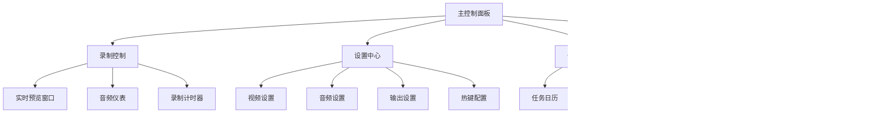

# 用户界面层设计文档

## 概述

用户界面层基于Qt 6框架开发，提供直观易用的图形界面，使用户能够方便地控制屏幕录制过程、配置参数和管理录制文件。该层与应用服务层交互，将用户的操作转化为具体的业务指令。

## 架构设计

### 界面模块设计



## 核心界面组件

### 1. 主窗口 (MainWindow)

```cpp
class MainWindow : public QMainWindow {
    Q_OBJECT

public:
    MainWindow(QWidget* parent = nullptr);
    ~MainWindow();

private slots:
    void onStartRecording();
    void onPauseRecording();
    void onStopRecording();
    void onSettingsChanged();
    void onScheduledTasksChanged();

private:
    void setupUI();
    void setupActions();
    void setupMenus();
    void setupToolbars();
    void setupStatusBar();
    
    // 界面组件
    std::unique_ptr<RecordingControlPanel> recordingPanel;
    std::unique_ptr<SettingsDialog> settingsDialog;
    std::unique_ptr<SchedulerWidget> schedulerWidget;
    std::unique_ptr<FileBrowserWidget> fileBrowser;
    
    // 应用服务
    std::unique_ptr<RecordingService> recordingService;
    std::unique_ptr<SettingsManager> settingsManager;
    std::unique_ptr<LocalScheduler> scheduler;
    std::unique_ptr<FileManager> fileManager;
};
```

### 2. 录制控制面板 (RecordingControlPanel)

```cpp
class RecordingControlPanel : public QWidget {
    Q_OBJECT

public:
    RecordingControlPanel(QWidget* parent = nullptr);
    
signals:
    void startRequested();
    void pauseRequested();
    void stopRequested();
    
private:
    void setupUI();
    
    // UI控件
    QPushButton* startButton;
    QPushButton* pauseButton;
    QPushButton* stopButton;
    QLabel* timerLabel;
    QProgressBar* audioMeter;
    QLabel* previewLabel;
    
    // 状态管理
    RecordingStatus currentStatus;
};
```

### 3. 设置对话框 (SettingsDialog)

```cpp
class SettingsDialog : public QDialog {
    Q_OBJECT

public:
    SettingsDialog(QWidget* parent = nullptr);
    
    AppSettings getSettings() const;
    void setSettings(const AppSettings& settings);
    
private:
    void setupUI();
    void setupConnections();
    
    // 设置页面
    std::unique_ptr<VideoSettingsWidget> videoPage;
    std::unique_ptr<AudioSettingsWidget> audioPage;
    std::unique_ptr<OutputSettingsWidget> outputPage;
    std::unique_ptr<HotkeySettingsWidget> hotkeyPage;
    
    QTabWidget* tabWidget;
    QDialogButtonBox* buttonBox;
};
```

### 4. 任务调度器组件 (SchedulerWidget)

```cpp
class SchedulerWidget : public QWidget {
    Q_OBJECT

public:
    SchedulerWidget(QWidget* parent = nullptr);
    
private:
    void setupUI();
    void refreshTaskList();
    
    // UI控件
    QCalendarWidget* calendar;
    QTableWidget* taskList;
    QPushButton* addButton;
    QPushButton* removeButton;
    QPushButton* editButton;
    
    // 数据模型
    std::unique_ptr<LocalScheduler> scheduler;
};
```

### 5. 文件浏览器组件 (FileBrowserWidget)

```cpp
class FileBrowserWidget : public QWidget {
    Q_OBJECT

public:
    FileBrowserWidget(QWidget* parent = nullptr);
    
private:
    void setupUI();
    void refreshFileList();
    void playSelectedFile();
    
    // UI控件
    QTreeWidget* fileTree;
    QPushButton* playButton;
    QPushButton* deleteButton;
    QPushButton* exportButton;
    
    // 数据模型
    std::unique_ptr<FileManager> fileManager;
};
```

## 界面布局设计

### 主窗口布局

```
+-----------------------------------------------------+
| 菜单栏                                             |
+----------------------+------------------------------+
| 工具栏               |                              |
+----------------------+        预览区域              |
| 侧边栏               |                              |
| - 录制控制           +------------------------------+
| - 设置               | 状态栏                       |
| - 任务调度           |                              |
| - 文件浏览器         |                              |
+----------------------+------------------------------+
```

### 录制控制面板布局

```
+-----------------------------------------------------+
| [开始录制] [暂停] [停止]                           |
+-----------------------------------------------------+
| 音频电平: [||||||||||                              ]|
+-----------------------------------------------------+
| 预览窗口                                          |
|                                                   |
|                                                   |
|                                                   |
+-----------------------------------------------------+
| 录制时长: 00:00:00                                |
+-----------------------------------------------------+
```

## 界面交互设计

### 1. 实时预览

```cpp
class PreviewWidget : public QWidget {
    Q_OBJECT

public:
    void updatePreview(const QImage& frame);
    
protected:
    void paintEvent(QPaintEvent* event) override;
    
private:
    QImage currentFrame;
    QMutex frameMutex;
};
```

### 2. 音频可视化

```cpp
class AudioMeterWidget : public QWidget {
    Q_OBJECT

public:
    void updateLevel(float level);
    
protected:
    void paintEvent(QPaintEvent* event) override;
    
private:
    float currentLevel;
    QMutex levelMutex;
};
```

### 3. 热键配置

```cpp
class HotkeySettingsWidget : public QWidget {
    Q_OBJECT

public:
    HotkeySettingsWidget(QWidget* parent = nullptr);
    
private:
    void setupUI();
    void registerHotkeys();
    
    // 热键映射表
    std::map<QString, QKeySequence> hotkeyMap;
    
    // UI控件
    QTableWidget* hotkeyTable;
    QPushButton* recordButton;
};
```

## 主题与样式

### 深色主题

```css
/* dark_theme.css */
QWidget {
    background-color: #2b2b2b;
    color: #ffffff;
}

QPushButton {
    background-color: #3c3f41;
    border: 1px solid #555555;
    padding: 5px;
}

QPushButton:hover {
    background-color: #4a4e52;
}

QProgressBar::chunk {
    background-color: #5d8aa8;
}
```

### 浅色主题

```css
/* light_theme.css */
QWidget {
    background-color: #ffffff;
    color: #000000;
}

QPushButton {
    background-color: #f0f0f0;
    border: 1px solid #cccccc;
    padding: 5px;
}

QPushButton:hover {
    background-color: #e0e0e0;
}

QProgressBar::chunk {
    background-color: #4169e1;
}
```

## 国际化支持

### 语言切换

```cpp
class LanguageManager {
public:
    void switchLanguage(const QString& languageCode);
    QStringList getAvailableLanguages() const;
    
private:
    QTranslator translator;
    QString currentLanguage;
};
```

### 翻译文件示例

```ts
// zh_CN.ts
<context>
    <name>MainWindow</name>
    <message>
        <source>Start Recording</source>
        <translation>开始录制</translation>
    </message>
    <message>
        <source>Pause Recording</source>
        <translation>暂停录制</translation>
    </message>
    <message>
        <source>Stop Recording</source>
        <translation>停止录制</translation>
    </message>
</context>
```

## 硬件资源监控面板

```cpp
class ResourceMonitorWidget : public QWidget {
    Q_OBJECT

public:
    ResourceMonitorWidget(QWidget* parent = nullptr);
    
private:
    void updateResourceUsage();
    void setupUI();
    
    // UI控件
    QProgressBar* cpuBar;
    QProgressBar* memoryBar;
    QProgressBar* diskBar;
    
    QTimer* updateTimer;
};
```

## 本地帮助系统

### 离线文档

```cpp
class HelpBrowser : public QTextBrowser {
    Q_OBJECT

public:
    HelpBrowser(QWidget* parent = nullptr);
    
private:
    void setupHelpContent();
    
    QMap<QString, QString> helpPages;
};
```

## 错误提示与用户反馈

### 消息框封装

```cpp
class UIMessageHandler {
public:
    static void showMessage(const QString& title, const QString& message, MessageType type);
    static bool showConfirm(const QString& title, const QString& message);
    
private:
    static QMessageBox::Icon getIcon(MessageType type);
};
```

## 响应式设计

### 窗口大小适应

```cpp
void MainWindow::resizeEvent(QResizeEvent* event) {
    // 根据窗口大小调整布局
    if (width() < 800) {
        // 紧凑布局
        sidebar->setVisible(false);
        // ...
    } else {
        // 标准布局
        sidebar->setVisible(true);
        // ...
    }
    
    QMainWindow::resizeEvent(event);
}
```

## 测试策略

### UI自动化测试

使用Qt Test框架进行界面测试：

```cpp
class TestMainWindow : public QObject {
    Q_OBJECT

private slots:
    void initTestCase();
    void testStartRecording();
    void testSettingsDialog();
    void cleanupTestCase();
    
private:
    std::unique_ptr<MainWindow> mainWindow;
};
```

### 用户体验测试

1. 界面响应速度测试
2. 多语言支持测试
3. 主题切换测试
4. 热键功能测试

## 依赖关系

用户界面层主要依赖：
- Qt 6框架 (GUI, Widgets, Core)
- 应用服务层接口
- 平台原生API (用于系统集成)

## 性能优化

### 界面渲染优化

1. 使用双缓冲减少闪烁
2. 异步加载预览图像
3. 合理使用信号槽机制
4. 避免频繁的UI更新

### 内存管理

```cpp
class UIManager {
public:
    static void cleanupUnusedResources();
    
private:
    static std::set<QObject*> trackedObjects;
};
```

## 可访问性支持

### 键盘导航

```cpp
void MainWindow::setupAccessibility() {
    // 设置Tab顺序
    setTabOrder(startButton, pauseButton);
    setTabOrder(pauseButton, stopButton);
    
    // 设置快捷键
    startButton->setShortcut(QKeySequence("Ctrl+R"));
    stopButton->setShortcut(QKeySequence("Ctrl+Shift+R"));
}
```

### 屏幕阅读器支持

确保所有UI控件都有适当的辅助功能属性：

```cpp
startButton->setAccessibleName(tr("Start Recording Button"));
startButton->setAccessibleDescription(tr("Click to start screen recording"));